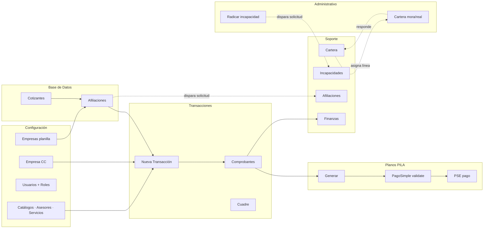

# Arquitectura — Sistema PILA

> Documento vivo. Actualízalo cuando agregues un módulo nuevo o cambies un
> contrato externo (PagoSimple, BDUA/RUAF, etc.).

## Visión general

Sistema integral para una operadora colombiana de **Planilla Integrada de
Liquidación de Aportes (PILA)**. Permite a sucursales aliadas:

1. Mantener una base de cotizantes y empresas clientes.
2. Generar comprobantes de cobro (afiliación, mensualidad) y consolidarlos
   en planillas PILA por empresa o independiente.
3. Subir las planillas al operador externo **PagoSimple**, donde se validan
   y se paga vía PSE.
4. Llevar **cartera** (estados de cuenta de EPS/AFP/ARL/CCF) y registrar
   gestiones de cobro.
5. Radicar **incapacidades** y hacerles seguimiento hasta el pago.
6. Cobrar internamente al aliado por los servicios prestados (finanzas).

## Stack

| Capa           | Tecnología                                            |
| -------------- | ----------------------------------------------------- |
| Web/UI         | Next.js 15.1 App Router · React 19 · TailwindCSS 4    |
| Auth           | NextAuth v5 (JWT + bcrypt)                            |
| ORM            | Prisma 6.19                                           |
| BD             | PostgreSQL 16 (Neon)                                  |
| Lenguaje       | TypeScript estricto                                   |
| Workspace      | pnpm + monorepo (apps/web, apps/cli, packages/db)     |
| PDFs           | `@react-pdf/renderer` (genera) · `pdf-parse` (parsea) |
| Excel/CSV      | `xlsx`                                                |
| Notificaciones | In-app (Postgres) — email/SMS pendiente               |
| Integraciones  | PagoSimple (API REST)                                 |

## Modelo de roles

```
ADMIN ────────► acceso total · matriz de permisos · operación de plataforma
SOPORTE ──────► cross-tenant · gestiona cartera, incapacidades, afiliaciones
ALIADO_OWNER ─► dueño de una sucursal · facturación, cobranza, planillas
ALIADO_USER ──► operador de la sucursal · permisos refinados por rol custom
```

`ADMIN` y `SOPORTE` son **staff**: ven todas las sucursales. Los otros dos
están **scopeados** por su `sucursalId`.

## Mapa de dominios



## Estructura del repo

```
mi-proyecto/
├── apps/
│   ├── web/                    Next.js 15 App Router
│   │   ├── src/app/            Rutas (admin, api, login, etc.)
│   │   │   ├── admin/          UI principal
│   │   │   └── api/            Endpoints REST + health check
│   │   ├── src/lib/            Lógica de dominio (no UI)
│   │   │   ├── pagosimple/     Cliente HTTP, parsers, config
│   │   │   ├── planos/         Generador de TXT PILA
│   │   │   ├── cartera/        Parsers de PDFs por entidad
│   │   │   ├── incapacidades/  Storage, retención 120d
│   │   │   ├── finanzas/       Cobro aliados, parsers extracto
│   │   │   ├── soporte-af/     Disparos de solicitudes
│   │   │   ├── notificaciones  Helper emitir + consultar
│   │   │   └── ...
│   │   └── src/components/     UI compartida
│   └── cli/                    CLI ops (seeders, jobs, util)
│       └── src/commands/       retention-run · pagosimple-sync · cobros · etc.
├── packages/
│   └── db/                     Prisma schema + cliente compartido
│       └── prisma/
│           ├── schema.prisma
│           └── migrations/     SQL versionado
└── docs/                       Esta carpeta
```

## Flujos críticos

### 1. Generación y carga de planilla PILA

```
1. Aliado factura cotizantes en `Transacciones` → crea Comprobantes.
2. En `Planos`, agrupa Comprobantes pendientes por (empresa | independiente)
   × período de aporte → genera Planilla.
3. Botón "Generar planilla" dispara:
   a. crea row en `Planilla` estado=CONSOLIDADO
   b. genera TXT (resolución 2388/2016) en memoria
   c. POST a PagoSimple `/payroll/upload` con multipart
   d. si OK, guarda `pagosimpleNumero` y `pagosimpleEstadoValidacion`
   e. si hay errores autocorregibles, dispara POST `/payroll/correction`
4. Cron `pagosimple-sync-planillas` cada 15min revalida estados y totales.
5. Cuando el operador confirma pago vía PSE, `estado=PAGADA` (TODO: wireado
   en sync auto, ver Sprint 1.5).
```

### 2. Radicación de incapacidad

```
1. Aliado en /admin/administrativo/incapacidades → busca cotizante por doc.
2. Sistema autocompleta: empresa, EPS/AFP/ARL/CCF, fecha afiliación.
3. Aliado sube documentos (cédula, certificado, historia clínica, etc.).
4. Action `radicarIncapacidadAction`:
   a. valida, calcula días
   b. crea `Incapacidad` + `IncapacidadDocumento[]`
   c. registra primera gestión en bitácora (`accionadaPor=ALIADO`)
   d. emite notificación `SOPORTE_NUEVA_INCAPACIDAD` a rol SOPORTE
5. Soporte gestiona desde /admin/soporte/incapacidades → cambia estado.
6. Al día 121 desde la creación, el cron `retention:run` borra el archivo
   físico pero conserva el registro como evidencia.
```

### 3. Ciclo de cartera

```
1. Soporte sube PDF de estado de cuenta de una entidad SGSS.
2. Parser específico (Salud Total / SURA / Sanitas / SOS / Protección)
   extrae cabecera + líneas → `CarteraConsolidado` + `CarteraDetallado[]`.
3. Match automático por NIT empresa y por cédula cotizante.
4. Soporte revisa cada línea y la marca:
   - EN_CONCILIACION (default) — en estudio
   - CONCILIADA                — descartada/aclarada con la entidad
   - MORA_REAL                 — deuda probable, visible al aliado
   - CARTERA_REAL              — deuda firme, visible al aliado
   - PAGADA_CARTERA_REAL       — el aliado pagó
5. Cuando MORA_REAL/CARTERA_REAL, emite notif `ALIADO_CARTERA_ASIGNADA`
   a la sucursal, que la ve en /admin/administrativo/cartera.
6. Aliado registra gestiones (notas/pago) → emite notif
   `SOPORTE_RESPUESTA_CARTERA` a rol SOPORTE.
```

## Notificaciones

Modelo `Notificacion` con targeting tripartito. Una notificación llega a:

| Target              | Quién la ve                        |
| ------------------- | ---------------------------------- |
| `destinoUserId`     | Un usuario específico              |
| `destinoRole`       | Todos los usuarios de ese rol      |
| `destinoSucursalId` | Todos los usuarios de esa sucursal |

El estado "leída" se guarda por usuario en `NotificacionLectura` (porque
una notif por rol/sucursal puede leerla cada usuario en momentos distintos).

Tipos vigentes:

- `SOPORTE_NUEVA_AFILIACION` — el aliado registró/modificó/reactivó una afiliación.
- `SOPORTE_NUEVA_INCAPACIDAD` — el aliado radicó una incapacidad nueva.
- `SOPORTE_RESPUESTA_CARTERA` — el aliado registró gestión sobre una línea.
- `ALIADO_CARTERA_ASIGNADA` — soporte marcó MORA_REAL/CARTERA_REAL en una línea.
- `ALIADO_GESTION_INCAPACIDAD` — soporte gestionó una incapacidad de la sucursal.

UI: campana en TopBar con polling de 60s al endpoint
`/api/notificaciones/count`.

## Jobs y crons

Comandos del CLI (`pnpm cli <cmd>`):

| Comando                     | Frecuencia recomendada       | Qué hace                                                  |
| --------------------------- | ---------------------------- | --------------------------------------------------------- |
| `retention:run`             | Diario, 03:00 UTC            | Borra archivos de incapacidad >120d, conserva el registro |
| `pagosimple:sync-planillas` | Cada 15 min · L-V · 8-17 BOG | Re-consulta PagoSimple para actualizar estado y totales   |
| `cobros:run`                | Mensual (día 1)              | Genera CobroAliado por sucursal según planillas del mes   |

Wire-up: GitHub Actions en `.github/workflows/`. Ver Sprint 1.4-1.6.

## Endpoints públicos (sin autenticación)

| Ruta          | Propósito                   |
| ------------- | --------------------------- |
| `/api/auth/*` | Callbacks de NextAuth       |
| `/api/health` | Health check para monitoreo |

Cualquier otra ruta `/api/*` requiere sesión válida — el middleware redirige
a `/login` si no hay sesión.

## Convenciones

- Mensajes y nombres en español.
- Comentarios en español, presente, sin emojis salvo donde el branding lo pida.
- Server actions retornan `{ ok?: true } | { error?: string }`.
- Validación en server con Zod (`@/lib/validations.ts`).
- Tablas Prisma en español, `@@map("snake_case")`.
- Consecutivos importantes (planilla, comprobante) usan `nextval()` Postgres
  para ser atómicos. Catálogos (asesor, servicio, cuenta CC) usan
  `findFirst+max+1` por simplicidad — migrar a sequence si la concurrencia
  crece.

## Variables de entorno

Ver [`.env.example`](../.env.example) — está totalmente comentado.

## Próximos pasos

Roadmap activo en `Sprint 1` (blindaje básico). Ver [`docs/roadmap.md`](./roadmap.md)
cuando exista. Mientras, el plan de los próximos 3 meses está en el chat
de la sesión donde se discutió.
